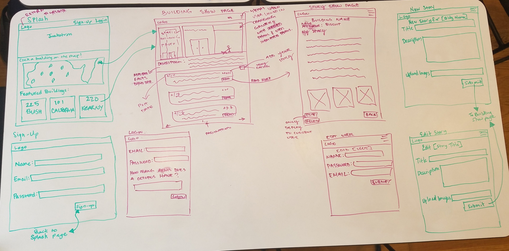

# Building Stories

## Goals
Create a place for building lovers to share stories and facts.

## Project Timeline
Time-frame: 5 days
* Part 1 - Initial planning phase: Research other building sites, create user stories, wireframes, data-model relations, determine group strengths
* Part 2 - Coding: Setting up routes and making sure basic functionality works
* Part 3  - Dividing up tasks: 
- Set up responsive google maps 
- Navbar and backgrounds 
- Created form pages views 
- Photo uploading feature 
- Pagination 
- Image gallery.
* Part 4 - Site walk through & code review:
- Finiding and repairing bugs
- Refactoring code

## Developement Team
Alison Walas,  Nuranne Dairkee, Cindy Le

## Built With
* Ruby on Rails
* Bootstrap 3.3.7
* Paperclip - ImageMagick
* jQuery-rails
* geocoder
* gmaps4rails
* font-awesome-sass
* fotorama
* will_paginate

## Deployment
Heroku: https://whatsthatbuilding.herokuapp.com/

## Wireframes:

